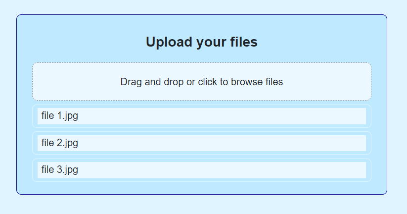

# \# Django + React file upload

This application is a simple file upload application created with Django and React.
<br>
<br>


<br>
<br>

## \# Installation
<br>

### Dependencies
Install Python (version 3.10) and Poetry (version 1.3.1) or higher versions
<br>
<br>

### Server (Backend)
Run the following command

```
source ./venv/Scripts/activate
```

Then

```
poetry install
```
<br>

### File upload screen (Frontend)

Go to the folder frontend and install all node_modules

```
cd frontend
pnpm install
```

\* You can also use yarn to install
<br>
<br>


## \# Running
<br>

### Server (Backend)
Open a terminal window and run
<br>

```
./runserver.sh
```
<br>

### File upload screen (Frontend)

Open a terminal window and run

```
cd ./frontend
pnpm run dev
```

